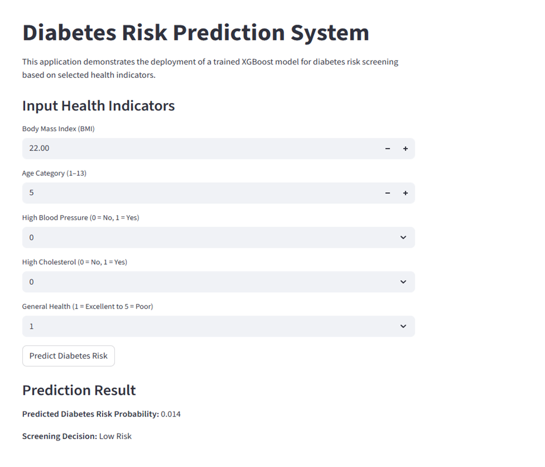
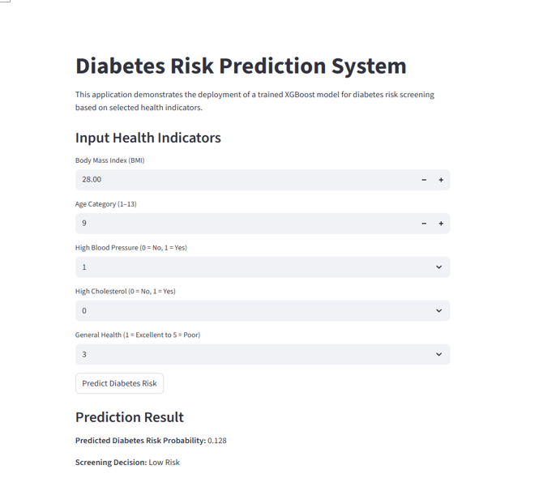
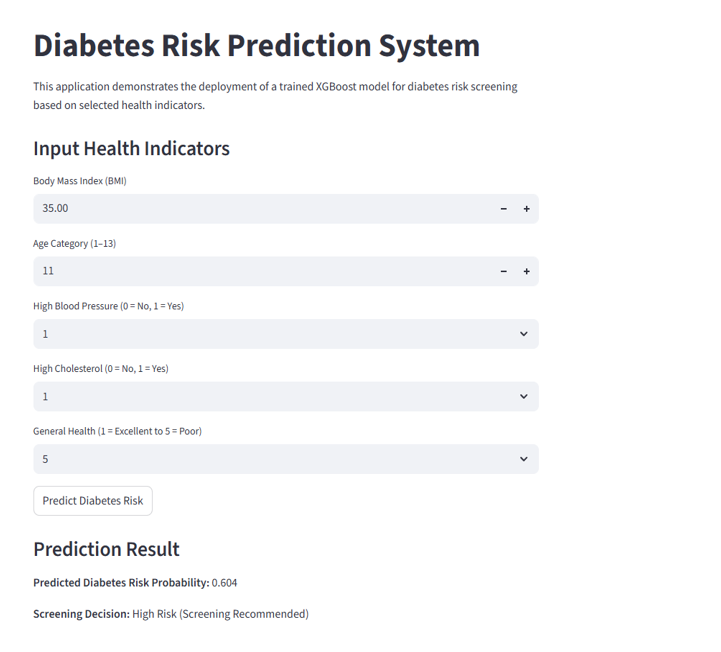

# Diabetes Risk Prediction System

A machine learning web application that predicts diabetes risk based on key health indicators, built as a Final Year Project using the BRFSS 2015 dataset.

---

## 📌 Project Overview

This project involves end-to-end development of a diabetes risk prediction system — from data preprocessing and model training to deployment as an interactive web application. The system allows users to input their health indicators and receive a real-time diabetes risk assessment.

**Dataset:** CDC Behavioral Risk Factor Surveillance System (BRFSS) 2015 — ~400,000 records  
**Best Model:** XGBoost (ROC-AUC: ~0.84)  
**Key Improvement:** Recall for high-risk cases improved from ~0.60 to ~0.75 via threshold optimisation

---

## 🖥️ App Demo

| Low Risk | Moderate Risk | High Risk |
|----------|--------------|-----------|
|  |  |  |

The app takes 5 health indicators as input and outputs:
- **Predicted Diabetes Risk Probability** (0.0 – 1.0)
- **Screening Decision:** Low Risk / High Risk (Screening Recommended)

---

## 🛠️ Tech Stack

| Category | Tools |
|----------|-------|
| Language | Python 3.x |
| ML & Modelling | XGBoost, Scikit-learn, SHAP |
| Data Processing | Pandas, NumPy |
| Web App | Streamlit |
| Notebook | Jupyter Notebook |

---

## 📁 Project Structure

```
diabetes-risk-prediction-xgboost/
├── app/
│   └── streamlit_app.py         # Streamlit web application
├── model/
│   └── xgb_weighted_diabetes_model.pkl  # Trained XGBoost model
├── notebooks/
│   └── diabetes_xgboost_model_development.ipynb  # Full ML pipeline
├── .gitignore
└── README.md
```

---

## ⚙️ How to Run

**1. Clone the repository**
```bash
git clone https://github.com/limjaiyie/diabetes-risk-prediction-xgboost.git
cd diabetes-risk-prediction-xgboost
```

**2. Install dependencies**
```bash
pip install streamlit xgboost scikit-learn pandas numpy shap
```

**3. Run the app**
```bash
streamlit run app/streamlit_app.py
```

---

## 🔍 Input Features

| Feature | Description |
|---------|-------------|
| BMI | Body Mass Index |
| Age Category | 1 (18–24) to 13 (80+) |
| High Blood Pressure | 0 = No, 1 = Yes |
| High Cholesterol | 0 = No, 1 = Yes |
| General Health | 1 = Excellent to 5 = Poor |

---

## 📊 Model Performance

| Metric | Score |
|--------|-------|
| ROC-AUC | ~0.84 |
| Recall (High-Risk) | ~0.75 (after threshold optimisation) |
| Baseline Recall | ~0.60 |

**Key findings from SHAP analysis:** BMI, Age, and General Health were identified as the top contributing features for diabetes risk prediction.

---

## 👤 Author

**Lim Jia Yie**  
BSc (Hons) Computer Science (Data Analytics)  
Asia Pacific University (APU) & De Montfort University (DMU)
